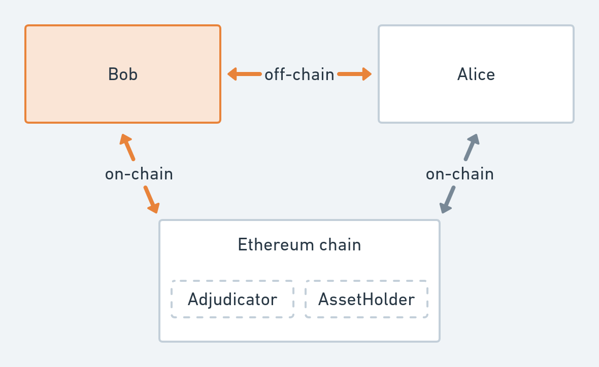

# HLL Budapest - Code Intro (Unfinished version)



**Alice**: Accepts the payment channel and sends/accepts payments.  
**Bob**: What we will build today. Should open a channel with Alice and send payments.  
**Ethereum chain**: Local ethereum development chain.  
**Adjudicator** and **AssetHolder** are smart contracts that are deployed to the chain by Alice.

## Execution

Running the example requires [golang](https://golang.org) and [ganache-cli](https://github.com/trufflesuite/ganache-cli).
In one terminal window, start ganache-cli with:
```sh
ganache-cli -e 1000 -b 1 -g 0 -a 2 -m "pistol kiwi shrug future ozone ostrich match remove crucial oblige cream critic"
```
or if you want to use docker, you can prefix the command with  
`docker run -it --rm -p 8545:8545 trufflesuite/`.

In a second terminal window, navigate to the example directory and enter:
```sh
go run .
```
